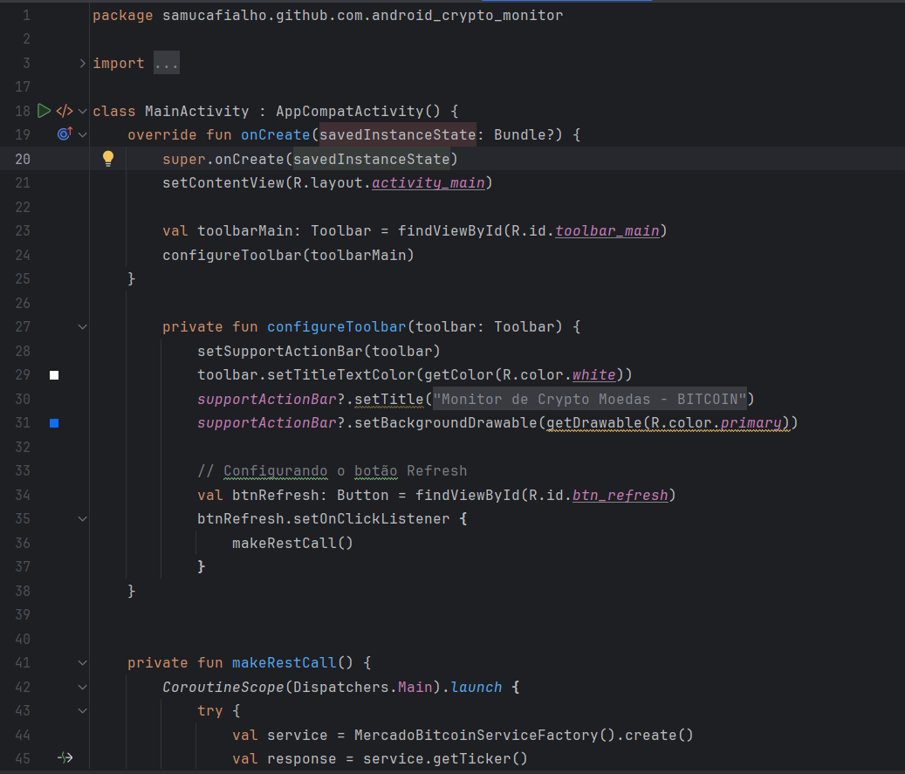
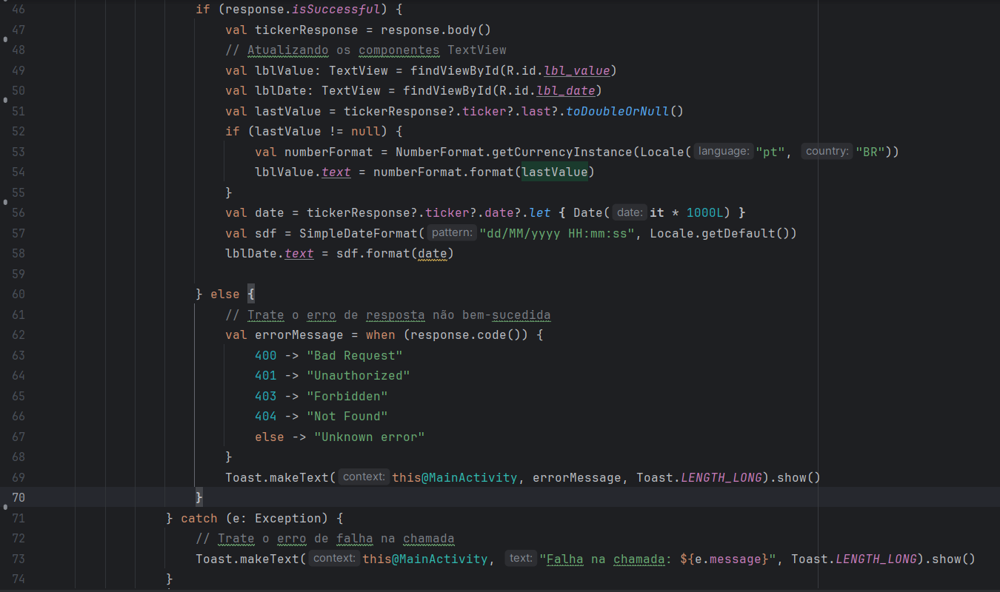
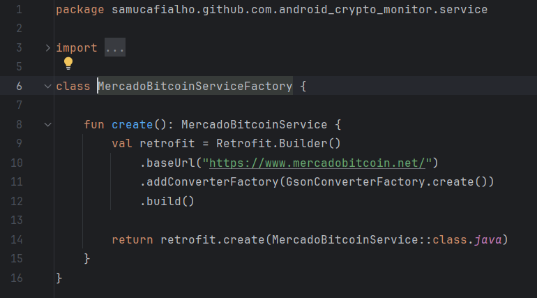
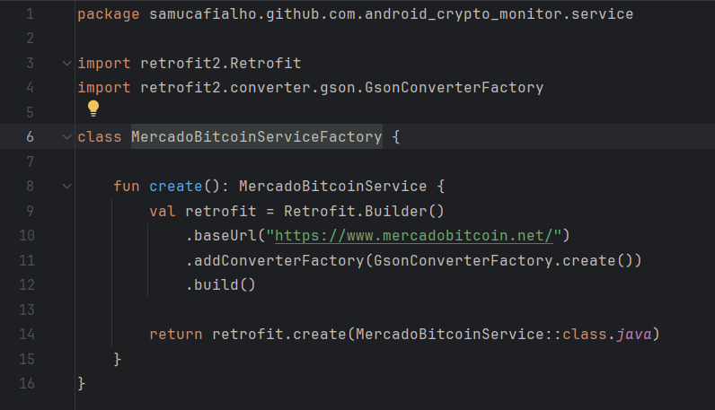
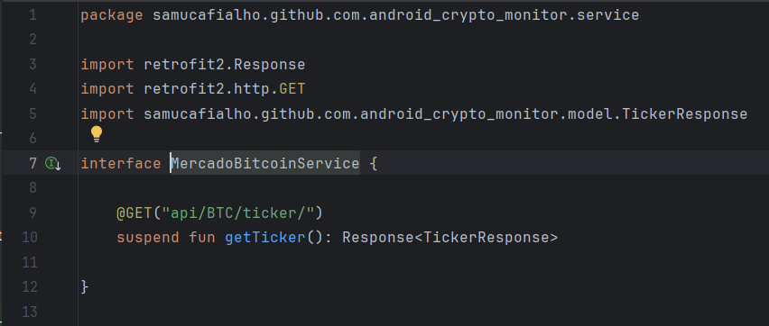
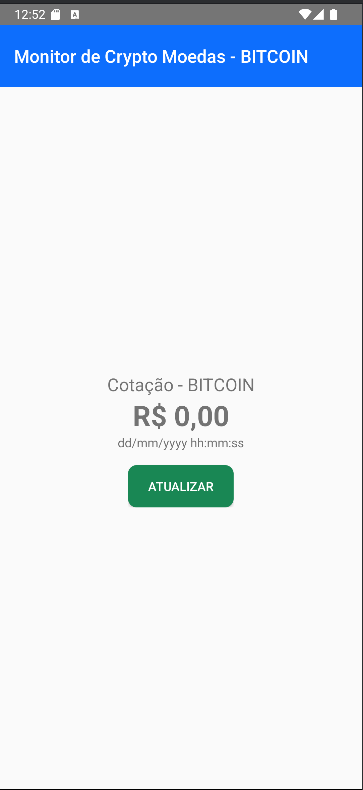

# Arquivo Main
O MainActivity é uma activity, ou seja, representa a tela que será aberta. Ele funciona como uma lógica de aplicação, fazendo a ponte entre o que o
usuário vê e o que acontece por trás. No Layout activity_main, definimos o que será exibido e, no MainActivity nós gerenciamos tudo que fica por trás.
Como por exemplo: Qual layout será exibido através do setContentView, definição dos eventos de clique, o que acontece quando a tela é aberta, etc..

## Exemplo de Evidências:

# Arquivo Factory
O ServiceFactory é um classe que é usada para entregar serviços prontos para o programador já utilizar.
E uma ServiceFactory, podemos configurar dependências, fazer uma conexão com uma API, é como se fosse uma fábrica mesmo, que 
entrega os serviços prontos.
A criação do arquivo ServiceFactory é uma boa prática de códigos, que pode ou não ser usado por um time de desenvolvimento.

## Exemplo de Evidências:

# Services
Services são Serviços que rodam sem precepção do usuário, executando tarefas que o usuário não vê. No caso usado em aula, 
não declaramos para o Serviço do Android que o "MercadoBitcoinService" e o "MercadoBitcoinServiceFactory" são services, porque não são,
é só uma organização feita para melhor codificação.

## Exemplo de Evidências Service: 

# Resultado final

